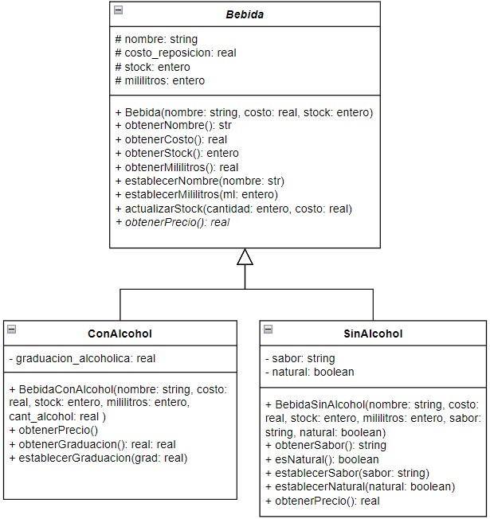

# Segundo parcial - Tema 1

## API de bebidas para la Taberna de Moe

Moe desea implementar en su taberna una API que le permita gestionar las bebidas. Intentó realizarla pero tuvo problemas.

Moe quiere establecer los precios de las bebidas de forma distinta:
- El precio de venta de las bebidas sin alcohol surge de incrementar un 50% el costo de reposición.
- El precio de venta de las bebidas alcohólicas se calcula como el costo de reposición más un 60%.

### Modelo de Datos

Las bebidas están modeladas de la siguiente manera:

### Tarea

Moe comenzó a desarrollar la API pero no la terminó. 

1. Completá el código que falta para que la API funcione. 
2. Corregí los errores que cometió Moe. Donde corrijas un error agregá un comentario indicando el error corregido.

### Descripción de la API

La API de bebidas debe permitir realizar las siguientes operaciones:

1. **Crear una bebida**: Crear una nueva bebida con o sin alcohol proporcionando los atributos necesarios como nombre, costo, stock, mililitros, y otros específicos de cada tipo de bebida.
2. **Obtener todas las bebidas**: Recuperar una lista de todas las bebidas almacenadas en el sistema.
3. **Obtener una bebida por nombre**: Recuperar los detalles de una bebida específica utilizando su nombre.
4. **Actualizar una bebida**: Modificar los atributos de una bebida existente.
5. **Eliminar una bebida**: Eliminar una bebida del sistema utilizando su nombre.

### Requisitos

- Revisa el código existente y completa las funciones faltantes.
- Asegurate de que todas las operaciones CRUD funcionen correctamente. Para ello deberás crear el entorno virtual, activarlo e instalarle Flask.
- Corregí cualquier error que encuentres en la implementación actual y documentá los cambios realizados.

¡Buena suerte y manos a la obra!